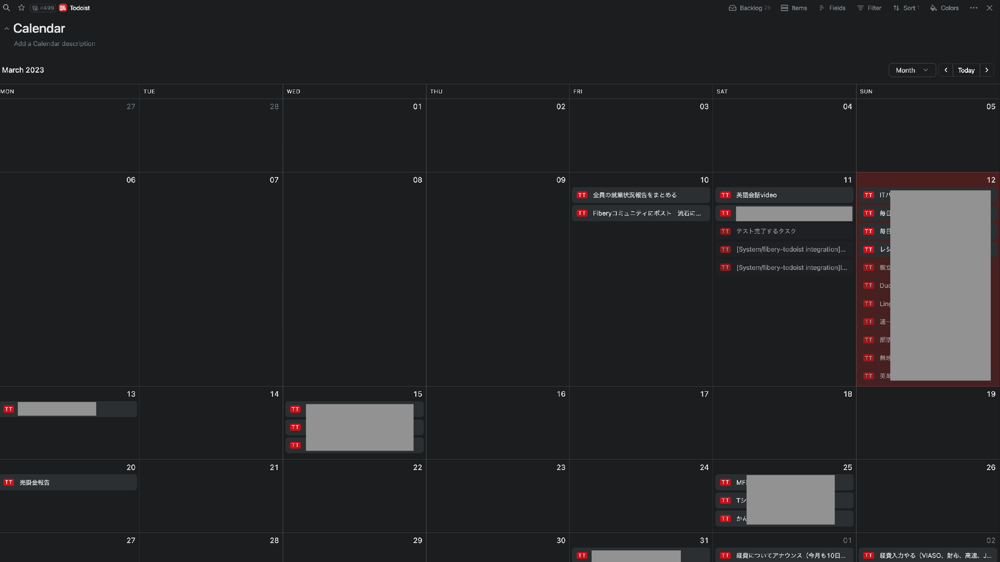
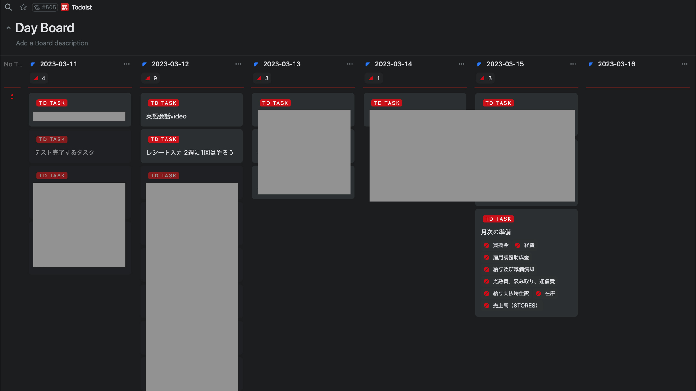
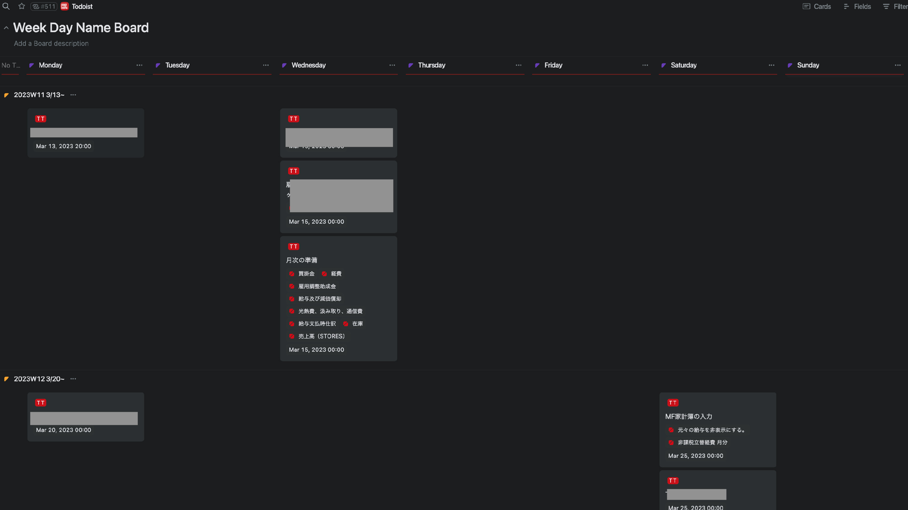
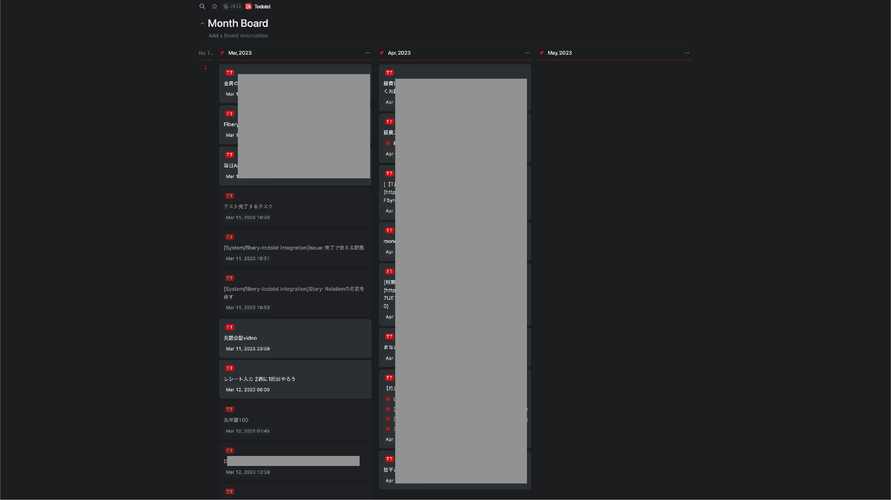
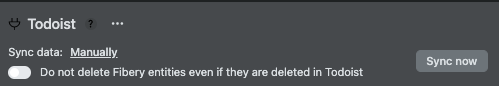
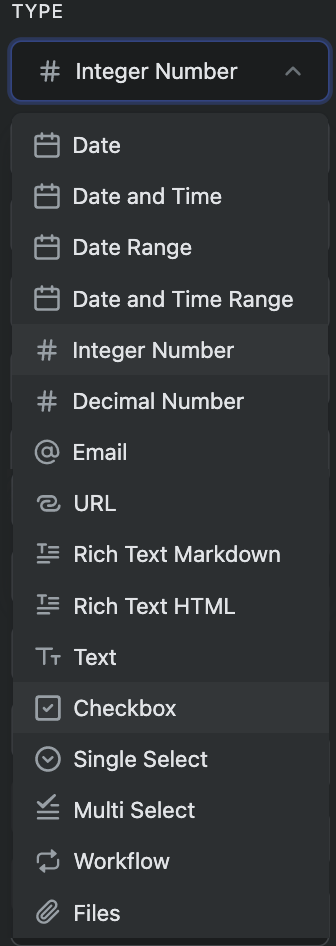

# Fibery - Todoist integration app

## Overview

Status: Under development

Currently, this project is a personal development project for myself. Please use it for testing purposes as it is subject to major changes in the future.

This is an integration app to import and display Todoist tasks and projects in Fibery.

Currently, this is a unidirectional synchronous integration feature that only displays Todoist tasks and projects on the Fibery side.

As of March 2023, a Bata version [partial bi-directional sync](https://the.fibery.io/@public/User_Guide/Guide/Jira-two-way- sync-159) has been implemented as a Bata version.

In the future, when bi-directional sync development becomes available for the Fibery integration API, we intend to implement bi-directional sync in this project as well.

 

## Usage

This is still a development version, so please clone and host it by yourself.

  ## Usage

## Implemented features

- Unidirectional synchronization of Todoist Task, Project, Label, and Collabolator.
- Automatic synchronization of any period of time (every 60 to 240 minutes) set in Fibery.
- Provides not only the same display as Todoist, but also more diverse perspectives through the use of the originally implemented Day, Week, Month, and Week day name DBs.
- (*Completed Items are also retrieved, but the number of items retrieved is subject to the limitations of your Todoist plan)

  ## Features we would like to implement in the future

## Features we would like to implement in the future
- (Not developed) Implement bi-directional sync of some attributes.
- (pending) Implement near realtime sync with incoming webhooks.
- (Confirmation of specification/probably not possible)Implementation of partial overwrite.

  ## Features

This view is similar to Todoist's Board view and can also display subtasks.        

Vertical axis is the day of the week of ISO week, which Todoist cannot display.  
This display is similar to a calendar, but can show more fields.      

## Ingenious point
- In Todoist, the completion status of a task is handled by the bool value of checked, but in order to make it visually clear on the Fibery side, it is synchronized as a Work Flow.
- Implementing the time zone was quite a challenge. I implemented it by making full use of `utc()` and `utc(true)` in [Day.js](https://day.js.org/en/).

 

## Things I noticed during development (to other developers)

- You can also specify workflow as a subType of text, in addition to what is listed in the documentation.
  - I think the subtype can probably use most of the dropdown in the image below (untested)
  - 

 

## References.

- [Todoist Sync API v9](https://developer.todoist.com/sync/v9/)
- [Fibery integration API](https://api.fibery.io/apps.html)
- [Fibery Guide about Timezones](https://the.fibery.io/@public/User_Guide/Guide/Timezones-41)
- [Fibery integration app example Notion app](https://gitlab.com/fibery-community/notion-app)
- [Fibery integration app example Public Holiday app](https://gitlab.com/fibery-community/holidays-integration-app)
- [Fibery integration app example Sample apps](https://gitlab.com/fibery-community/integration-sample-apps)
- Day.js](https://day.js.org/)