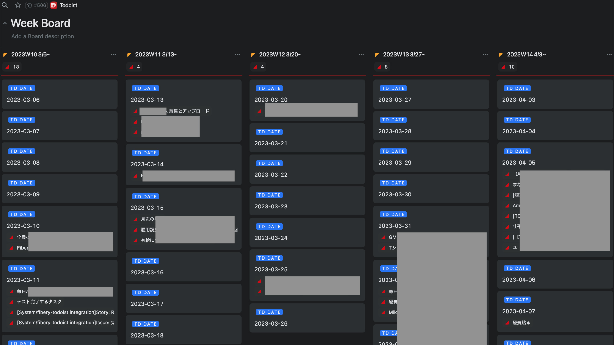
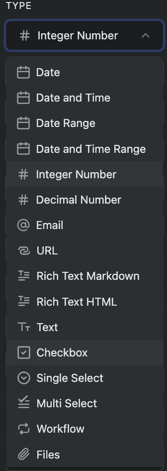

# Fibery - Todoist integration app

## Overview

Status: 開発中

現状、本プロジェクトは自分のための個人開発プロジェクトです。今後大きな変更をする可能性があるので、ご利用の際はテスト目的でご利用ください。

FiberyでTodoistのタスクやプロジェクトを取り込んで表示するための統合機能アプリです。

現在は、TodoistのタスクやプロジェクトをFibery側で表示するだけの、単一方向同期の統合機能です。

2023年3月現在、Fibery公式が開発したJIRAの統合機能にて、Bata版として[部分的なBi-directional sync](https://the.fibery.io/@public/User_Guide/Guide/Jira-two-way-sync-159)が実装されています。

今後、Fibery integration APIでもBi-directional sync開発が可能になったら、本プロジェクトでも双方向同期を実装するつもりです。

 

## Usage

現状まだ開発版なので、ご自身でcloneしてホストしていただきますようお願いいたします。

 

## 実装した機能

- TodoistのTask, Project, Label, Collabolatorの単一方向同期
- Fiberyで設定した任意の期間（60分〜240分間隔）での自動同期
- 独自に実装したDay, Week, Month, Week day nameというDBにより、Todoistと同等の表示のみならず、より多様な視点の提供
- (※Completed Itemsも取得しますが、取得数はご利用のTodoistプランの制約に準拠します)

 

## 今後実装したい機能
- (開発不可)一部属性のBi-directional syncの実装
- (仕様確認中)incoming webhookでのnear realtime syncの実装
- (仕様確認中/不可能かも)部分上書きの実装

 

## Features

### Sample and suggested views

Todoistには存在しないカレンダービューでタスク一覧を確認できます。 

TodoistのBoardビューに近い表示ができ、サブタスクも表示できます。 

Todoistではできない、週表示です。 

Todoistでは表示できない、縦軸がISO週の曜日表示です。 
カレンダーに近い表示ですが、より多くのフィールドを表示できます。 

月表示です。例えば、週や月次でのみ発生する繰り返しタスクのみにフィルタすれば、外観の予定を把握することができると考えられます。 

### And more...

その他、Fiberyの自由さをTodoistに適用できます。

今後、本アプリが安定/成熟したら、過去のデータを残す設定をON(下の画像参照)にして完了タスクの評価が行えるグラフを生成したりできるということも考えられます。

TodoistのKarmaの再現もできるかもしれません。

 

## 工夫した点
- Todoistでタスクの完了ステータスは、checkedのbool値で取り扱われますが、Fibery側でビジュアルとしてわかりやすくするために、Work Flowとして同期しています。
- タイムゾーンの実装はなかなか大変でした。[Day.js](https://day.js.org/en/)の`utc()`や`utc(true)`を駆使して実装しました。

 

## 開発中に私が気づいたこと（他の開発者へ）

- textのsubTypeとして、ドキュメントに記載されている以外にworkflowも指定できる。
  - subtypeは多分下の画像のドロップダウンが大体使えると思います（未検証）
  - 

 

## References

- [Todoist Sync API v9](https://developer.todoist.com/sync/v9/)
- [Fibery integration API](https://api.fibery.io/apps.html)
- [Fibery Guide about Timezones](https://the.fibery.io/@public/User_Guide/Guide/Timezones-41)
- [Fibery integration app example Notion app](https://gitlab.com/fibery-community/notion-app)
- [Fibery integration app example Public Holiday app](https://gitlab.com/fibery-community/holidays-integration-app)
- [Fibery integration app example Sample apps](https://gitlab.com/fibery-community/integration-sample-apps)
- [Day.js](https://day.js.org/)